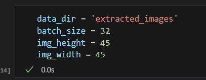
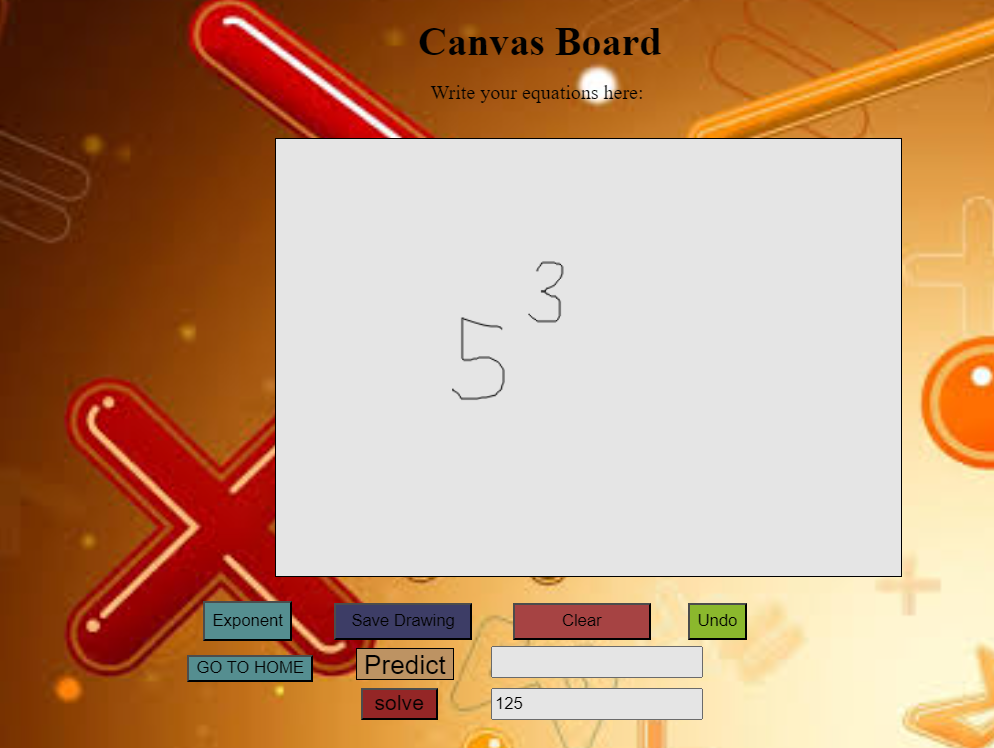
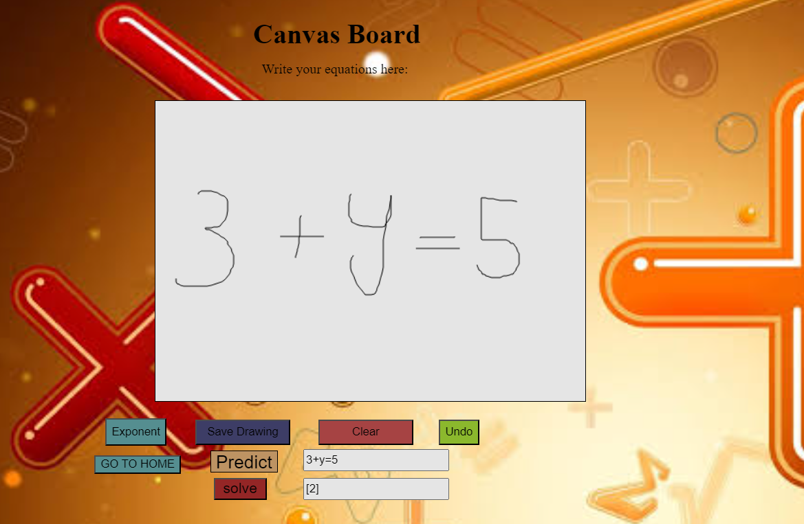
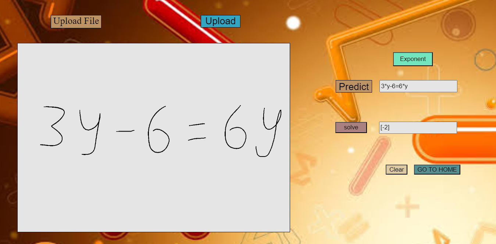
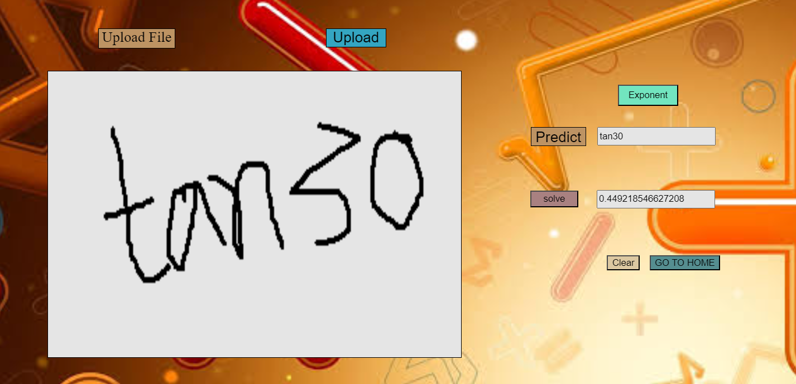

# Handwritten Equation Solver Using CNN  

--- 
I have used dataset from [kaggle](https://www.kaggle.com/datasets/xainano/handwrittenmathsymbols). You can download dataset and train model as per your choice. There are numerous math symbols which can be used for training, but as of now I have only choosen few basic symbols including sin, tan. This code is capable of solving linear equations and also finding out values of sin and tan. Well, I have got the **accuracy of 89.61%** and **loss of 0.8063** which are good values. Come on, now let's understand how to train the model.

---
## Training & Testing Steps
Once you've downloaded the dataset from kaggle, you have to create **extracted_images** folder in the project directory and move all the symbols folder in the folder that we just created. Now you are done with setting up files and folder for training. Let's start with training:-    
1. Open **train classifier.ipynb** file.
2. Check 3rd cell, there you've variable to set the path of training data folder.
3. In the 7th cell, our main **Convolutional Neural Network** is defined, which you can modify as per your knowldge to increase the accuracy of the model.
4.Run some more cells and start the training of model. Soon, you'll get the trained model.
1. Perform testing on equation image and check the result. 

Parameters that I considered are :- 
1. batch_size = 5
2. epoch = 5
3. initial_learning_rate=1e-3
4. decay_steps=10000
5. decay_rate=0.9  
Note : Change this as per your convenience 

## How to use 
1. create conda environment by using command **conda create -n <your_env_name> python=3.10.10**.(Note : Here, python environment is 3.10.10, so if you keep other python version, model will not load perfectly and will throw an error.)  
2. conda activate **<your_env_name>**.  
3. Run **pip install -r requirements.txt**.
4. Copy the relative path of the trained model and paste it in the **equation_calculator.py** file.  
5. Run **python app.py**.
   

## More information about this custom project
You can even write your equation on the canvas board. Once you run the **app.py** script. You'll get the chance to select option either to upload image or canvas board. You can select either of them. Check the image attached below to get the idea about it.

# Let's see some results

1. Exponent of the written numbers.
   
   

2. Linear equation written on canvas board.
   
   

3. Image uploaded having linear equation.  

    

4. Finding the value of trigonometric function.

    

**Thank you for your time!**